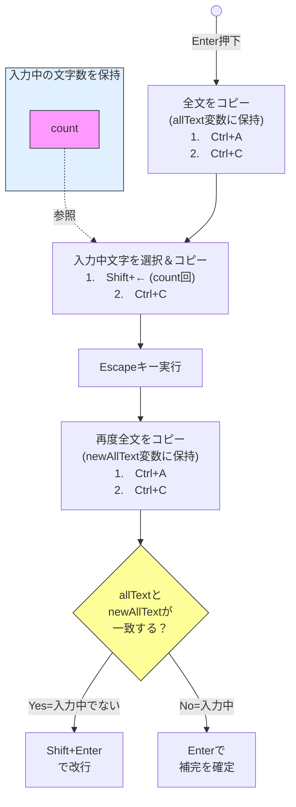

コードだけ欲しい方は[#コード]からお読みください。

# 環境
- windows 11 Home
- Microsoft IME（バージョンは？）
- Discordアプリ

# 背景(前提)
Discordは以下のようなキーバインドがされています。

- Enterで送信またはIMEの補完の確定
- Shift + Enterで改行

これで個人的に困ることは以下です。

- 半角英数字モードで入力しているとき、Enterを押したら送信されてしまう
- ひらがなモードで入力しているとき、IMEの補完の確定でEnterを押そうとして誤って2連続でEnterを押してしまった場合、送信されてしまう
- 改行するたびにわざわざキーを2つ(Shift + Enter)押す必要がある

「誤って送信してしまったので編集するはめになり、編集すると文の最後に `(edited)` という邪魔なものがついてしまう」という事象はDiscord界で頻発しているのでは？と思っています。これがストレスでした。

また、1つの文章につき送信は必ず1回しか行いません。しかし改行は複数回行われるということはよくあります。
なので改行はEnterという1つのキーだけで機能させたいという思いがありました。

簡単に言えば、**Slackと全く同じようにしたかった**という感じです。

実はDiscordアプリ側でキーバインドの設定をすることはできますが、なぜか改行・送信に関するものは用意されていないので、やはりアプリ側でカスタマイズすることは不可能です。
（なぜ用意しないのか、Discord側の思想(理由)が純粋に気になる）

この議題に関する記事はいくつかありますが、どれも上述の理想をかなえてくれるものではありませんでした。そもそもMacでしか動かなかったり、機能が物足りなかったりするものしかありませんでした。

なので自分で頑張って作ってみました。完璧に理想をかなえることができたので詳細を書いていきます。

# どんな感じで進めていったか
どんな思考プロセスで進めて、どんなことに苦戦したのかをつらつら書いていきます。

※記事を引用してそれに対して「こんな問題がありました」という形式にしていますが、決してその記事に問題があるという意図ではありません。すべてとても意義のある記事ですし、事実すごく助かりました。あくまで「私の今回の理想をかなえるためにはこの記事では不十分だった」という意味で「問題」と書いています。

---

まず、Karabiner-Elementsというソフトウェアで同じことをしている方がいることを知りました。
https://zenn.dev/mh/articles/ccd9fd185a66d4
https://zenn.dev/shuto2828/articles/63edac4f20f057

しかしこれはmacOS専用なのでWindowsでは使えませんでした😢
> A powerful and stable keyboard customizer for macOS.

https://karabiner-elements.pqrs.org/

---

そこで次にこちらの記事を見ました。
https://note.com/teruyoshikun/n/n0b7e1b45529d

これでAutoHotkeyというソフトウェア(スクリプト言語)の存在を知りました。

今度は逆にWindows専用！期待できます。
> The ultimate automation scripting language for Windows.

https://www.autohotkey.com/

しかしこの記事を読んだあと疑問・課題が4つ残りました。

1. なぜあえて古い方のv1.1を使うのか
    - できれば新しいバージョンを使いたい
2. なぜ.ahkではなく.ashという拡張子を使うのか
    - 公式では.ahkを使えと書かれている(v1とv2のドキュメント両方で)
    >  A script is simply a plain text file with the `.ahk` filename extension containing instructions for the program, like a configuration file, but much more powerful. 
  https://www.autohotkey.com/docs/v1/Program.htm
3. このコードだと、補完の確定をしようとEnterを押しても何も起こらない
    - わざわざCtrl + Enterを押さなければ補完確定できない
4. `shell::startup`を打ってもエラーになる（調べたらすぐ解決できたけど）


正直動けば良いので1, 2, 4は重要ではないのですが、3が私にとってはクリティカルでした。

ただキーバインドを設定するなら簡単にできそうなんですが、今回の様にIMEが関わると複雑になります。

そこで調べるうちに凄く良さげなものを見つけました。
https://w.atwiki.jp/eamat/pages/17.html

> AutoHotkey上で日本語入力の制御を可能にするための関数群

ドンピシャだ！と思いました。事実助かりました。
しかし1つだけ問題がありました。

**IME_GetConverting関数が機能しない**という問題です。
(IME_GET関数は機能する)

名前からわかるように「現在変換中かどうか(入力中かどうか)」を調べることのできる関数です。

変換中は1か2が返ってくるはずなのですが、どんな時でもなぜか0しか返ってこないのです。

これが使えれば、コードは以下のように書くだけで完成していたはずです。
```autohotkey
; Enterが押された時
Enter::
{
    converting := IME_GetConverting()
    if (converting > 0) {  ; もし入力中(補完候補がでている状態)だったら
        SendInput "{Enter}"  ; Enterで補完確定
    } else {  ; もし入力中ではない状態だったら
        SendInput "+{Enter}"  ; Shift + Enter で改行
    }
    return
}

; Ctrl + Enter が押された場合
^Enter::
{
    SendInput "{Enter}"  ; Enterで送信または補完確定
    return
}
```

自分の環境で試してみた結果、主要な関数の結果はこうなりました。

- **IME_GET**

ひらがなモードなら1、半角英数字モードなら0がちゃんと返ってくる

- **IME_GetConvMode**

9しか返ってこない

- **IME_GetSentenceMode**

8しか返ってこない

- **IME_GetConverting**

0しか返ってこない

---

ひらがなモードで入力中かどうか(補完が出ているかどうか)の状態が欲しかったので、何としてもIME_GetConverting関数は使いたかったのですが、諦めることにしました。

自分のMicrosoft IMEは新しいバージョンになっていたので、以前のバージョンにあえて戻してみたのですが、それでもIME_GetConvertingは0しか返してくれませんでした。
（ここをONにした）


つまり問題の核は、「関数が新しいMS IMEには対応してない」ということなのですが、結局対応させる方法がわかりませんでした。

---

次に考えたのは、**Escapeキー**を使用する方法です。

Escapeキーを実行すればひらがなモードで入力中の文字は消えますよね。

そこから、以下のようにやればいけるのではないかと考えました。



ですが、結果全然ダメでした。

# コード
ああ

# 使い方
ああ

# 最後に
- windowsでしか動きません
- macではkerbiner なんとかを使うと良いと思います
- windowsアプリ(ソフトウェア)として作成してそれを配布できたら楽だなぁと思っているのでいつかやりたい
