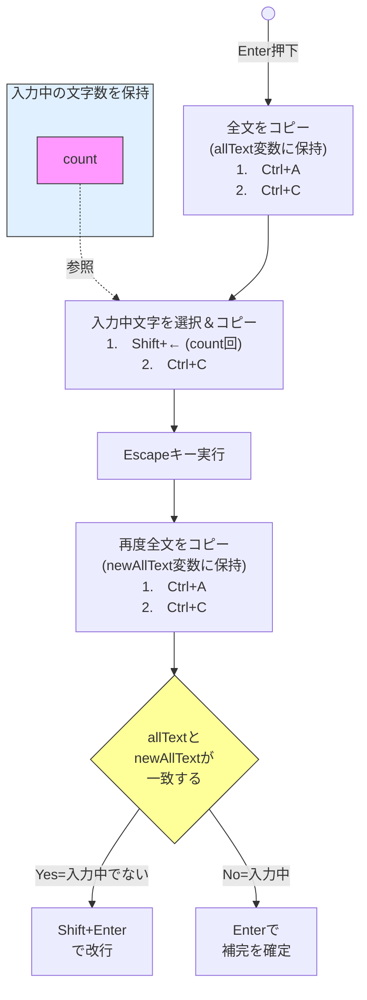
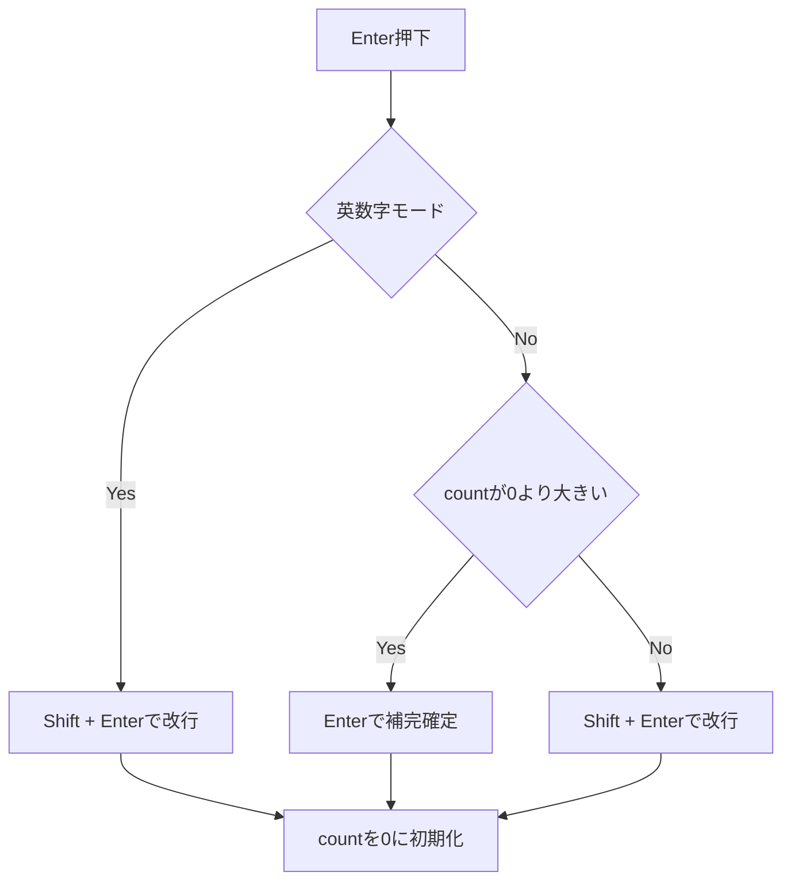

# 完成コード
https://github.com/clumsy-ug/discord_ahk_keybind/blob/main/DiscordKeybind.ahk

# 環境
- Windows 11 Home
- 標準搭載のMicrosoft IME
- Discordアプリ
- AutoHotkey バージョン2

# 背景(前提)
Discordは以下のようなキーバインドがされています。

- Enterで送信またはIMEの補完の確定
- Shift + Enterで改行

これで個人的に困ることは以下です。

- 半角英数字モードで入力しているとき、Enterを押したら送信されてしまう
- ひらがなモードで入力しているとき、IMEの補完の確定でEnterを押そうとして誤って2連続でEnterを押してしまった場合、送信されてしまう
- 改行するたびにわざわざキーを2つ(Shift + Enter)押す必要がある

「誤って送信してしまったので編集するはめになり、編集すると文の最後に `(edited)` という邪魔なものがついてしまう」という事象はDiscord界で頻発しているのでは？と思っています。これがストレスでした。

「補完確定」と「送信」のどちらもEnterであるという特性上、ミス送信が頻発することは容易に想像できます。

また、1つの文章につき送信は必ず1回しか行いません。しかし改行は複数回行われるということがよくあります。
なので、改行はEnterという1つのキーだけで機能させたいという思いがありました。

そして送信はCtrl + Enterにしたい訳です。


実はDiscordアプリ側でキーバインドの設定をすることはできますが、なぜか改行・送信に関するものは用意されていないので、やはりアプリ側でカスタマイズすることは不可能です。
（なぜ用意しないのか、Discord側の思想(理由)が純粋に気になる）

この議題に関する記事はいくつかありますが、どれも前述の理想をかなえてくれるものではありませんでした。そもそもMacでしか動かなかったり、機能が物足りなかったりするものしかありませんでした。

なので自分で頑張って作ってみました。完璧に理想をかなえることができたので詳細を書いていきます。

# どんな感じで進めていったか
どんな思考プロセスで進めて、どんなことに苦戦したのかをつらつら書いていきます。

---

まず、Karabiner-Elementsというソフトウェアで同じことをしている方がいることを知りました。
https://zenn.dev/mh/articles/ccd9fd185a66d4
https://zenn.dev/shuto2828/articles/63edac4f20f057

しかしこれはmacOS専用なのでWindowsでは使えませんでした😢
> A powerful and stable keyboard customizer for macOS.

https://karabiner-elements.pqrs.org/

---

そこで次に、私と同じWindows 11 Homeの環境を使用しているこちらの記事を見ました。
https://note.com/teruyoshikun/n/n0b7e1b45529d

これでAutoHotkeyというソフトウェア(スクリプト言語)の存在を知りました。
これはWindows専用！期待できます。
> The ultimate automation scripting language for Windows.

https://www.autohotkey.com/

しかし記事を読んだあと疑問・課題が4つ残りました。

1. なぜあえて古い方のv1.1を使うのかわからない
    - できれば新しいバージョン2を使いたい
    
2. なぜ`.ahk`ではなく`.ash`という拡張子を使うのかわからない
    - 公式では`.ahk`を使えと書かれている(v1とv2のドキュメント両方で)
    >  A script is simply a plain text file with the `.ahk` filename extension containing instructions for the program, like a configuration file, but much more powerful. 
  https://www.autohotkey.com/docs/v1/Program.htm
3. 記事のコードだけだと、補完の確定をしようとEnterを押しても何も起こらない
    - わざわざCtrl + Enterを押さなければ補完確定できない
4. `shell::startup`を打ってもエラーになる（調べたらすぐ解決できたけど）


正直動けば良いので1, 2, 4は重要ではないのですが、3が私にとってはクリティカルでした。

ただキーバインドを設定するだけなら簡単にできそうなんですが、今回の様にIMEが関わると複雑になります。

そこで調べるうちに凄く良さげなものを見つけました。
https://w.atwiki.jp/eamat/pages/17.html

> AutoHotkey上で日本語入力の制御を可能にするための関数群

ドンピシャだ！と思いました。事実助かりました。
しかし1つだけ問題がありました。

**IME_GetConverting関数が機能しない**という問題です。最終更新が2012年なので、新しいIMEに対応できていないからだと思われます。
(IME_GET関数は機能する)

名前からわかるように「現在変換中かどうか(入力中かどうか)」を調べることのできる関数です。

変換中は1か2が返ってくるはずなのですが、どんな時でもなぜか0しか返ってこないのです。

これが使えれば、コードは以下のように書くだけで完成していたはずです。
```autohotkey:DiscordKeybind.ahk
; Enterが押された時
Enter::
{
    converting := IME_GetConverting()
    if (converting > 0) {  ; もし入力中(補完候補がでている状態)だったら
        SendInput "{Enter}"  ; Enterで補完確定
    } else {  ; もし入力中ではない状態だったら
        SendInput "+{Enter}"  ; Shift + Enter で改行
    }
    return
}

; Ctrl + Enter が押された場合
^Enter::
{
    SendInput "{Enter}"  ; Enterで送信または補完確定
    return
}
```

自分の環境で試してみた結果、主要な関数の結果はこうなりました。

- **IME_GET**
ひらがなモードなら1、半角英数字モードなら0がちゃんと返ってくる

- **IME_GetConvMode**
9しか返ってこない

- **IME_GetSentenceMode**
8しか返ってこない

- **IME_GetConverting**
0しか返ってこない

ひらがなモードで入力中かどうか(補完が出ているかどうか)の状態が欲しかったので、何としてもIME_GetConverting関数は使いたかったのですが、結局使えませんでした。

また、自分のMicrosoft IMEは新しいバージョンになっていたので、以前のバージョンにあえて戻してみたのですが、それでもIME_GetConvertingは0しか返してくれませんでした。(↓をオンにしてもダメだった)


つまり問題の核は、「関数が新しいMS IMEには対応していない」ということなのですが、結局対応させる方法がわかりませんでした。

---

次に考えたのは、**Escapeキー**を使用する方法です。

ひらがなモードで入力中にEscapeキーを押すと入力中の文字は消えますよね。

ということで、ユーザーがEnterを押した際は裏で以下の処理を行えば良いのではないかと考えました。



ですが、結果全然ダメでした。

なぜなら、そもそも補完を確定してからでないとShift + ←で入力中の文字をコピーできないからです。

しかしその補完を確定するためにEnterを実行しても良いかどうかはわからない、というのが問題です。
なぜなら、補完は出ておらず(=補完確定済み)、Shift + Enterで改行したいだけなのかもしれないからです。

なのでやはり、**入力中かどうか(補完が出ているかどうか)という状態を取らないといけない**という根本課題は残り続けたままです。

---

あとは、「そういえばクリックするだけでも補完確定できるぞ！」ということに気付いたのでクリック実行関係を試しましたが、これも結局同じ結末でした。

なぜなら、**クリックして確実に補完確定後の状態にしたとしても、その後Enterを実行すべきかShift + Enterを実行すべきかわからないから**です。

以下のような感じです。

Enterが押される
↓
クリックを実行する（これにより入力中という状態ではなくなることが保証される）
↓
Shift + Enterを実行すべきかEnterを実行すべきかわからない

...やはり入力中かどうかをなんとかして判定しないとならない、という結果でした。

---

そしていろいろ考えていたら、**入力中の文字数を数えるcount変数をうまく使えば理想を実現できる**ことに気付きました。

countとは、先程のフローチャート図でも出てきたやつです。

この変数は、Enterが押される度に0に初期化します。そしてキーが押されるたびに+1します。

つまり、以下の処理を書けば理想を実現できるはずです。



実際のコード
```autohotkey:DiscordKeybind.ahk
; Enter が押された場合
Enter::
{
    ; 確認用
    ; ToolTip("countは: " . count)
    ; SetTimer () => ToolTip(), -2000

    global count
    imeMode := IME_GET()

    if (imeMode) {
        if (count == 0) {
            SendInput "+{Enter}"
        } else {
            SendInput "{Enter}"
            count := 0
        }
    } else {
        SendInput "+{Enter}"
        count := 0
    }

    return
}


; Ctrl + Enter が押された場合
^Enter::
{
    SendInput "{Enter}"
    return
}
```

これで試してみたらちゃんと動きました。やっとです。

ちなみに、AutoHotkeyのバージョン2に合わせて先程の関数群を更新してくれている方がおり、IME_GET関数はそこから使わせていただきました。私もバージョン2のAutoHotkeyで書いているので、助かりました。
https://qiita.com/kenichiro_ayaki/items/d55005df2787da725c6f
https://github.com/k-ayaki/IMEv2.ahk/blob/master/IMEv2.ahk

...ただ！実はまだ**英語を打って最後にひらがなモードに変えてからEnterを押すと送信されてしまう**という問題が残っています。

なぜなら、

英語を打って最後にひらがなモードに変えてからEnterを押す
↓
`count > 0` かつ ひらがなモード
↓
「補完が出ているはず！Enterで補完確定すべきだ！」と誤った判断をされてしまう

という流れになるからです。

これに対しては、英語モードとひらがなモードを切り替える半角/全角キーを`~sc029::`で取得できることがわかったので、そのスコープ内にcountを0に初期化する処理を書いて解決しました。
```autohotkey:DiscordKeybind.ahk
; 半角/全角 が押された場合（「英語->ひらがな」ならcountを0にする）
~sc029::
{
    global count
    ; 押された瞬間のモードが取得できるので、「英語->ひらがな」の変更では「英語」が取得される
    imeMode := IME_GET()

    if (!imeMode) {
        count := 0
    }

    ; 確認用
    ; ToolTip("countは" . count . " / " . "imeModeは" . imeMode)
    ; SetTimer () => ToolTip(), -2000

    return
}
```

---

ちなみに、countの処理はこのように書いています。
```autohotkey:DiscordKeybind.ahk
; キーが押された回数
global count := 0

; ほぼ全てのキーが押された際の処理(半角/全角キー などは不要なので除く)
~*a::
~*b::
~*c::
~*d::
~*e::
~*f::
~*g::
~*h::
~*i::
~*j::
~*k::
~*l::
~*m::
~*n::
~*o::
~*p::
~*q::
~*r::
~*s::
~*t::
~*u::
~*v::
~*w::
~*x::
~*y::
~*z::
~*1::
~*2::
~*3::
~*4::
~*5::
~*6::
~*7::
~*8::
~*9::
~*0::
~*Space::
~*,::
~*.::
~*/::
~*;::
~*[::
~*]::
~*-::
~*=::
{
    global count
    count++
    
    ; 確認用
    ; ToolTip("countは: " . count)  ; カウントをツールチップで表示
    ; SetTimer () => ToolTip(), -2000  ; 2秒後にツールチップを消す

    return
}
```

これで完成です🥳

# 使い方
ただ、PCの電源を入れるたびに毎回`.ahk`ファイルをダブルクリックして実行するのは面倒です。

そのため、この`.ahk`ファイルをスタートアップとして登録することで、PC起動時に自動的に起動するようにします。

方法は以下です。

1. Windows + R
2. `shell:common startup`と入力してEnter
3. 開いたフォルダ内に`.ahk`ファイルを配置

これで完了です。

# 最後に
この記事と同じような内容の記事は見当たらなかったので自力で考える必要がありましたが、実装できて良かったです。

Windowsアプリ(ソフトウェア)として作成してそれを配布できたら楽だなぁと思っているのでいつかやりたいです。

また、まだ試してませんが、
```autohotkey:DiscordKeybind.ahk
#HotIf WinActive("ahk_exe Discord.exe")
```
という部分を他のファイル名に変えれば、DiscordだけでなくGPTやClaudeなどの生成AIを使う際にも同じキーバインドを適用することができるはずです。
